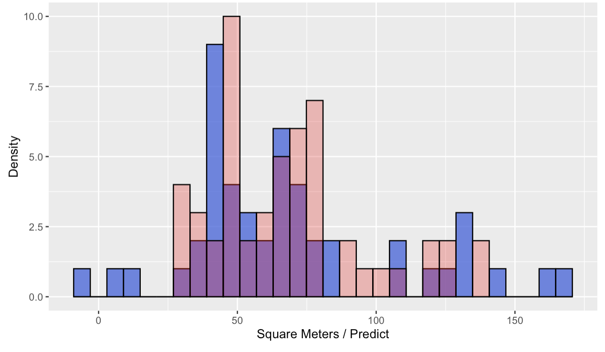

# Análisis de Datos de Alojamientos en Madrid con R

## Introducción 📊

Este análisis se ha realizado en el lenguaje de programación R, utilizando RStudio como IDE, con el objetivo de **entender y predecir los metros cuadrados de los alojamientos en Madrid**. R es un lenguaje gratuito y open-source, ideal para la estadística y la visualización de datos, mientras que RStudio proporciona una interfaz amigable y funcional para trabajar con R.

## Instalación y Configuración 💻

### R

Es necesario instalar R desde su [página principal](https://www.r-project.org/) siguiendo las instrucciones específicas para Windows, Mac-OS, o Linux.

### RStudio

Después de instalar R, continua con la instalación de RStudio, disponible de forma gratuita bajo la licencia AGPL v3 en [posit.co](https://posit.co/download/rstudio-desktop/).

En esta práctica se han usado notebooks de Quarto.

## Resumen de la práctica 👩🏼‍💻

La práctica consiste en una serie de ejercicios para limpiar, transformar y analizar un conjunto de datos de propiedades en Madrid. Se han realizado en ella tareas como la conversión de unidades, manejo de valores faltantes, agrupación de barrios, y modelado estadístico para predecir metros cuadrados de alojamientos sin datos.

Durante la práctica, se desarrollaron dos cuadernos de Quarto donde se experimentaron dos enfoques distintos para el manejo de datos atípicos y valores faltantes:

- **Opción A** (`Practica.qmd`): Este enfoque conservó los valores atípicos (outliers) dentro del conjunto de datos, tratándolos como variaciones reales y no como errores. Se implementaron dos modelos de regresión lineal para evaluar cómo cada uno afectaba las predicciones.

- **Opción B** (`Practica-Sin-Outliers.qmd`): En contraste, esta opción exploró el efecto de eliminar los valores atípicos para entender cómo su ausencia impactaría el análisis.

Tras un análisis comparativo, se decide adoptar la **Opción A**, manteniendo los valores atípicos. Esta decisión se basa en el entendimiento de que estos datos representan variabilidad real y son importantes para el modelo.

Además, se opta por eliminar los valores `NA` en la variable dependiente `Square.Meters` antes de la división en conjuntos de entrenamiento y prueba. La motivación detrás de esta elección es minimizar el número de predicciones de `NA`s por el modelo y asegurar que el entrenamiento y la evaluación se basen en datos más completos y representativos.

## Dificultades Encontradas 📈

La principal dificultad fue decidir entre eliminar o transformar los **outliers**. Otra incertidumbre fue **cómo manejar los registros con NA** en `Square.Meters` antes de dividir los datos en conjuntos de entrenamiento y prueba.

## Conclusiones y Reflexiones 🧠

El módulo representó un desafío significativo en términos de comprensión y aplicación de conceptos estadísticos avanzados. Las decisiones críticas en torno a la optimización y el preprocesamiento de los datos, así como el ajuste y la interpretación de los modelos estadísticos, destacaron la importancia de una práctica y dedicación más intensivas.

Aunque consciente de la necesidad de un aprendizaje continuo, espero haber alcanzado un nivel de conocimiento adecuado para cumplir con los requisitos básicos del módulo y me siento con motivacion para profundizar más en futuros módulos del Bootcamp, como machine learning y deep learning.